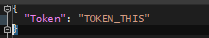
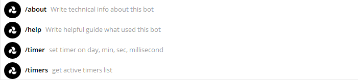
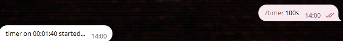
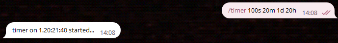
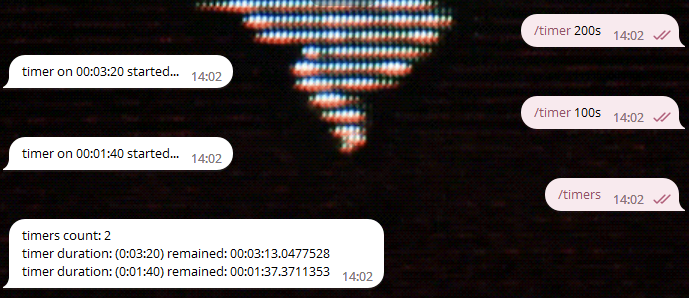

# AlercroyBot

> Useful telegram bot

### Getting started

The **first** thing to do is to set the token in the configuration file



**or** command line arguments

```c#
 dotnet run Token="U_TOKEN"
```

### Usage

Open **command list**



If you call the **/help** command with the arguments of the required command, 
then everything will be described in detail, the actions of the work and the parameters required

#### New timer session



more arguments list)



If you want to see active timers _=>_ use **/timers** and bot write all ur timers

